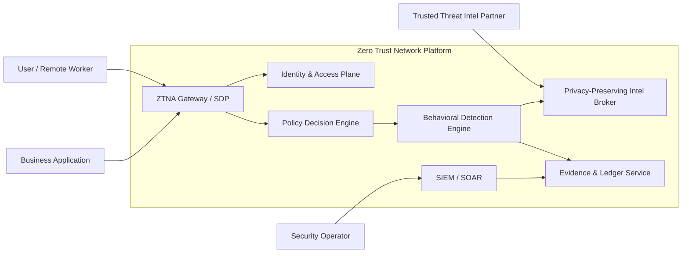
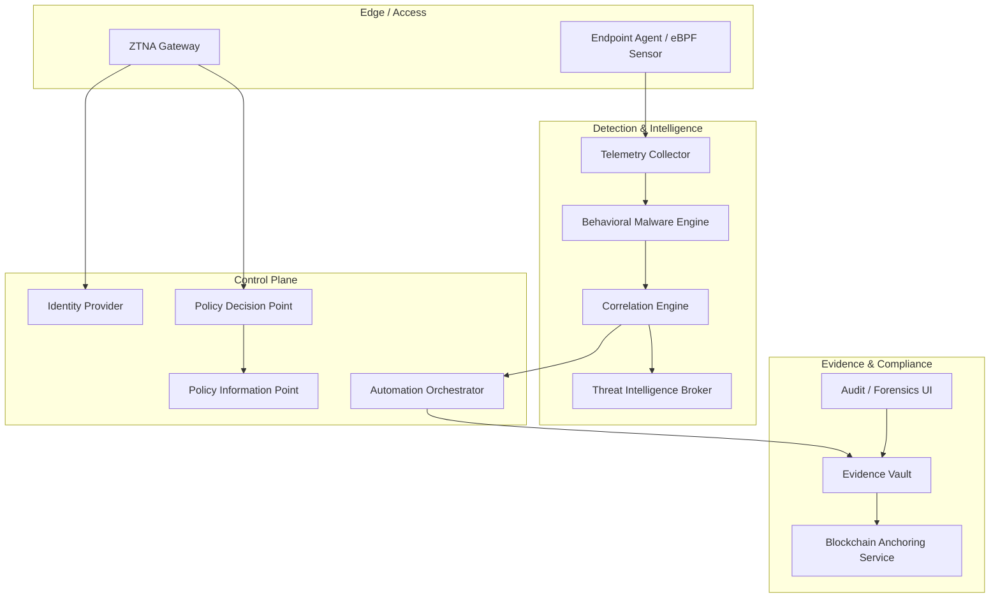
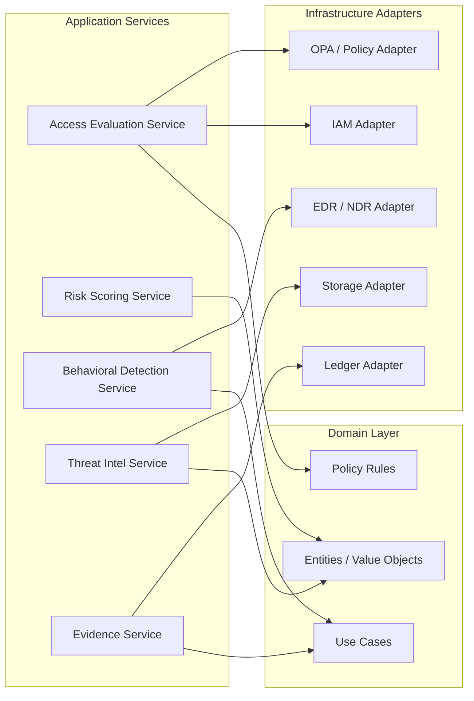

# C4-Style Diagrams

## 1. System Context Diagram

## 2. Container Diagram

## 3. Component Diagram

## Notes

- The control plane should be stateless and horizontally scalable.
- The evidence plane should be append-only and isolated from direct user access.
- The detection plane should support event replay and forensic investigation.
