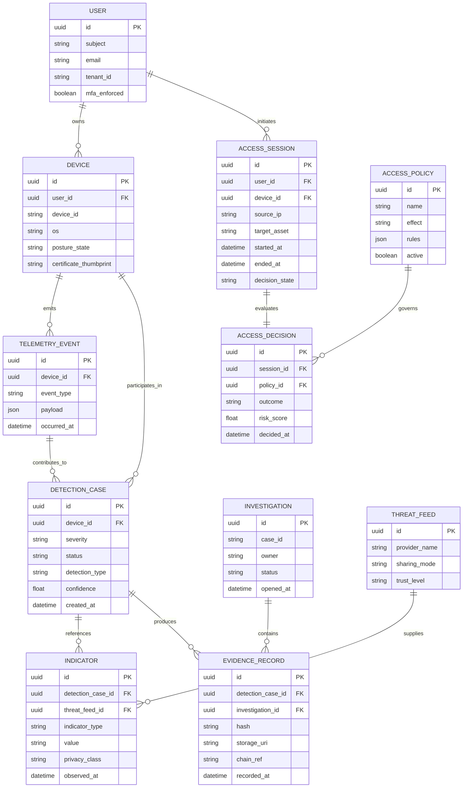

# Entity Relationship Diagram

## Relationships summary

- A user may own multiple devices.
- A device emits telemetry and participates in detections.
- Access sessions are evaluated against policies and yield decisions.
- Telemetry contributes to detection cases.
- Detection cases produce indicators and evidence.
- Evidence records are grouped into investigations and anchored to a ledger.
